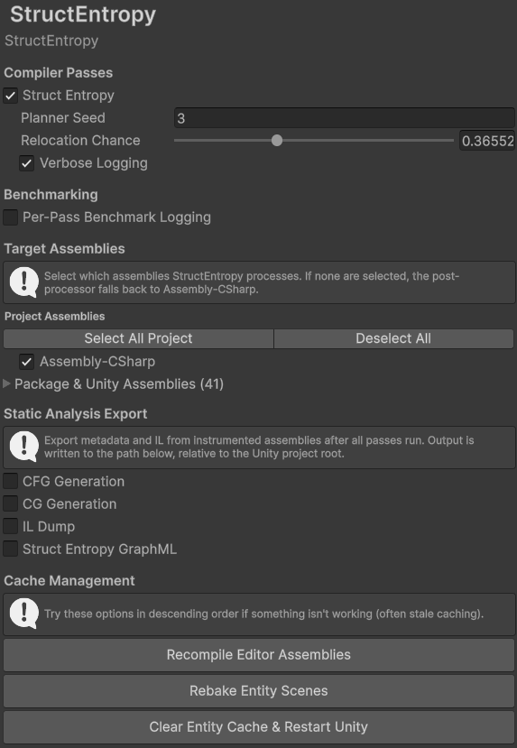
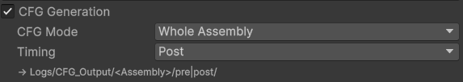
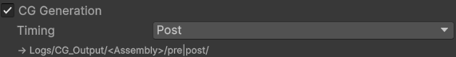
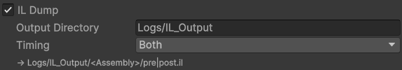
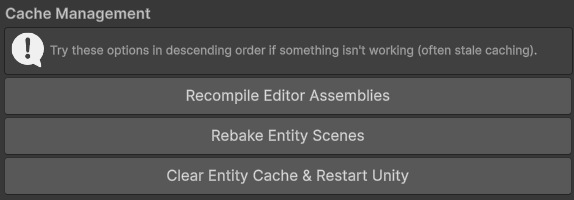
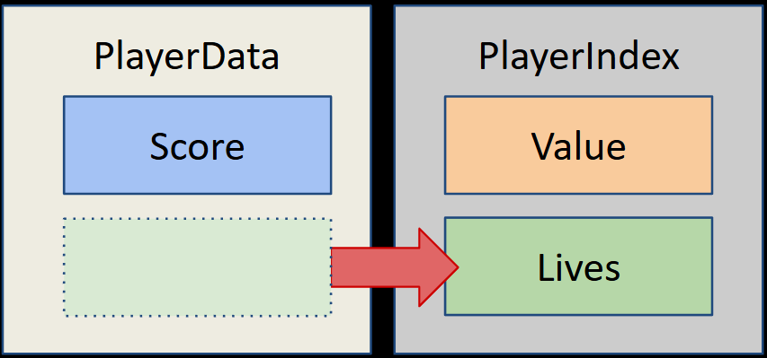
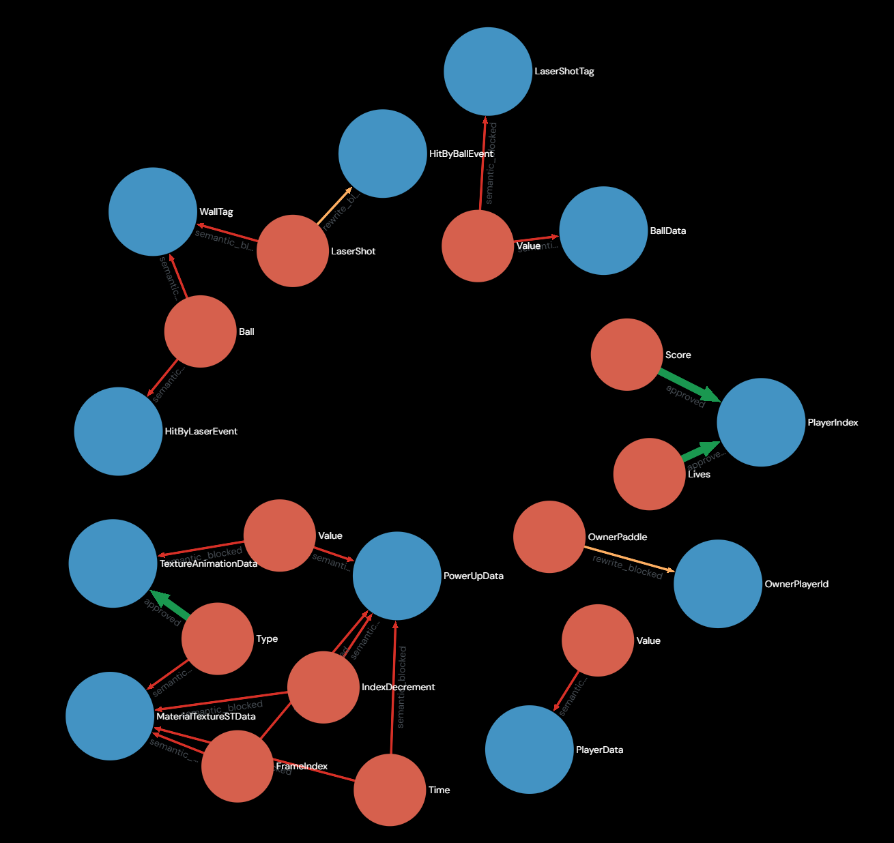

# Struct Entropy

A data obfuscation anti-cheat for Unity DOTS, presented at DEF CON 34.

## Overview

Struct Entropy is a Unity 6 DOTS ILPP pass that relocates fields between co-lifetimed `IComponentData` structs. This effectively obfuscates interesting game data, and breaks AOB and stable struct offset assumptions.

More information will be added here, including the original slides, after DEF CON 34.

## Installing

1. Clone this repository locally.
2. In a Unity 6 Editor (tested on `6000.3.6f1`), open the package mangager with `Window -> Package Management -> Package Manager`.
3. In the package manager, click the `+` button in the top left corner and select `Add package from disk...`.
4. Navigate to the `struct-entropy` folder ***INSIDE OF YOUR CLONE*** and select the `package.json` file.

## Using the Pass

You can open the struct entropy settings window with `Edit -> Project Settings -> StructEntropy`. You should see something like:

	

Each option in this panel is enumerated below:

### Compiler Passes

Checking the box next to **"Struct Entropy"** will enable the pass for any editor or player builds.

The **"Planner Seed"** is used to seed the random generator that picks destinations when multiple relocations might be valid for a field.

The **"Relocation Change"** slider controls the percent chance a given field will actually be relocated upon building.

**"Verbose Logging"** will spit out more information into the unity console during a compilation.

### Benchmarking

**"Per-Pass Benchmark Logging"** will print out to the console the elapsed time every registered ILPP pass took to run.

### Target Assemblies

This panel allows you to select which assemblies the pass should operate on. By default, it will operate upon only `Assembly-CSharp.dll`.

### Static Analysis Export

This panel contains various artifact creation options, useful for visualizing and debugging the passes work.

#### CFG Generation

**"CFG Generation"** outputs a `.graphml` file for the generated assemblies control flow graph into `Logs/CFG_Output/<AssemblyName>/pre|post`. **"CFG Mode"** lets you pick between "Whole Assembly" (everything in one file) or "Per Method" which outputs a file for each instrumented method. **"Timing"** controls whether this runs before (pre) or after (post) pass instrumentation occurs (picking "both" gives you, well, both). I use the web version of Gephi Lite to preview these, usually.

	

#### CG Generation

**"CG Generation"** outputs a `.graphml` file for the generated assemblies call graph into `Logs/CG_Output/<AssemblyName>/pre|post`. **"Timing"** controls whether this runs before (pre) or after (post) pass instrumentation occurs (picking "both" gives you, well, both). I use the web version of Gephi Lite to preview these, usually.

	

#### IL Dump

	

This option allows you to dump versions of the CIL to disk for introspection (really, really useful). **"Output Directory"** controls where the IL dump will be written to. **"Timing"** controls whether this runs before (pre) or after (post) pass instrumentation occurs (picking "both" gives you, well, both).

### Cache Management

	

The options in this panel are mostly here for development and debugging purposes. DOTS likes to do a lot of entity disk baking and caching, so many of these options are the go-to for "why the hell is my shit not working". I reccomend trying options top-to-bottom in this panel. The last option requires an editor restart, but only rarely have I needed this.  

## DOTS Arkanoid

The [DOTS-Arkanoid](https://github.com/EugenyN/DOTS-Arkanoid) Unity project (EugenyN, MIT License) located in `samples/DOTS-Arkanoid` has been tested with the pass, and is a good starting point. If you clone this repository and open the sample in Unity, it will be pre-configured with the pass already installed. Have fun!

If you compile Arkanoid with the following settings, you will see the following transformation:

Planner Seed: `3`

Relocation Chance: `0.365521`

	

Here's the planner output graph for Arkanoid (note that there is another valid relocation with powerup type, I have tested this, and it works!):

	

There is an AOB Cheat Engine Lua cheat script included in `cheats/DOTS-Arkanoid` which works on the unmodified game, but fails to work on the instrumented game. This is a good demo for how this can work on real project, and if you inspect the Assemblies in dnSpy, you will be able to observe the relocations between types.
